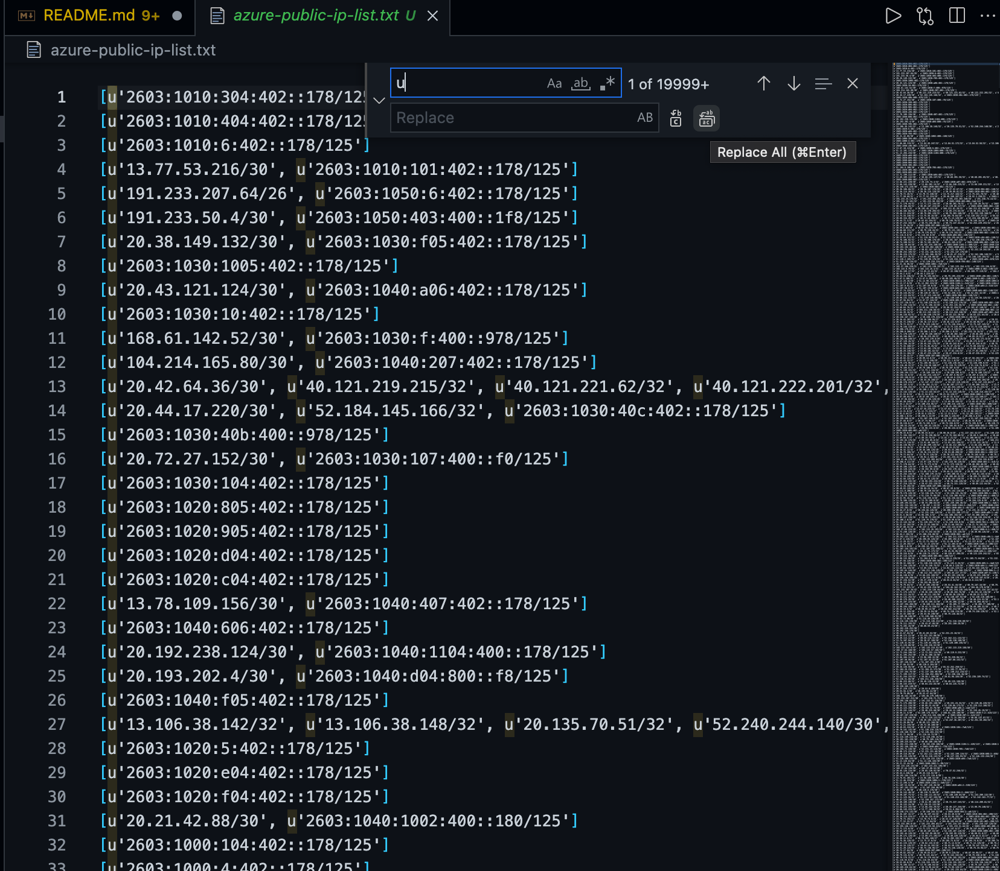

## list-only-ip-addresses-from-azure
### Listing and exporting only ip address (both v4 and v6) for azure
1. Clone this repo
2. Download the latest azure ServiceTags and Public IP json file from [here](https://www.microsoft.com/en-us/download/details.aspx?id=56519).

3. Place latest downloaded file to clone repo folder.

4. Point above downloaded file name in python script.

5. Run the python script.
    ```
     $   python azure-publi-ip-list.py > azure-public-ip-list.txt
    ```
6. Go to exported txt file and open it with vscode editor.
    * You'll see similar output and there will be more than thousands lines.


        

7. Now, Time for vscode editor part! Remove unnecessary keyworkd from exported text file with **Find and Replace** function which is included in vscode editor.

    * Replace **U** with blank.

    

    And then

    * Replace **single quote** with blank.

    

    Then,

    * Replace **open bracket** with blank.

    

    And then,

    * Replace **closed bracket** with blank again.

    

    * Now, This is final step. Some of the ip addresses are at single line, we'll separate them with a single line with enter.(will replace with **comma** to **enter** format.)

        * Bfore replace will be similar like below screenshot.


            

        * After replace with **\n** at vscode editor using with ***regular expression***, output will be similar like below screenshot.

            


8. Final Result will be look like below screenshot.
    


Cheer!!!

ref_urls [python-stackoverflow post](https://stackoverflow.com/questions/67058855/parsing-field-from-large-json-file-where-another-field-meets-a-condition-using), [find and replace new line vscode stackoverflow post](https://stackoverflow.com/questions/30351529/find-and-replace-with-a-newline-in-visual-studio-code) and [Current Azure Region Names](https://azuretracks.com/2021/04/current-azure-region-names-reference/).
